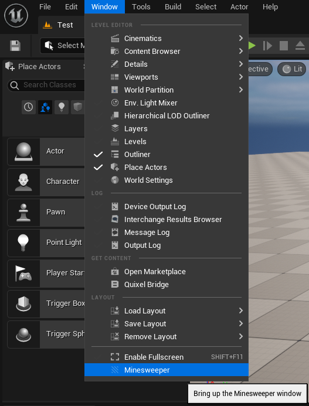
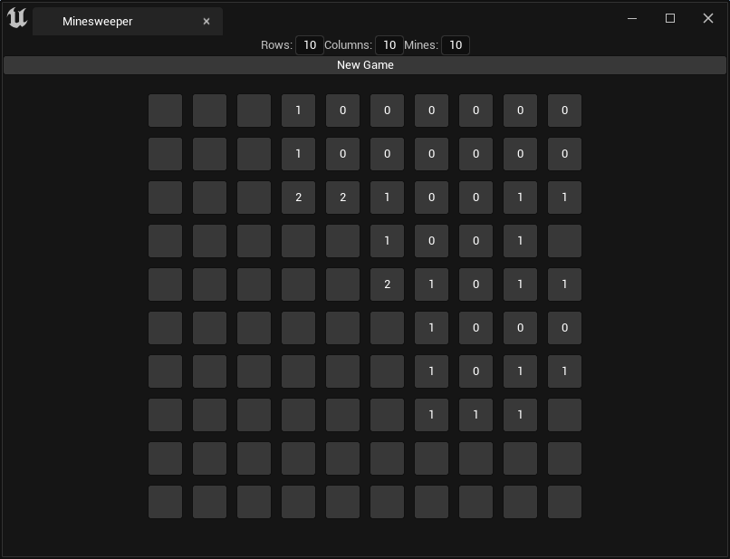

A minesweeper game project made for Unreal Engine 5.

## Structure
The game is implemented as a plugin under the `Plugins/MinesweeperGame` folder, it contains the following folders:

- `Logic`: contains the logic of the game.
- `Widgets`: contains the widgets used for the UI.
- `Windows`: contains the minesweeper window's code.

## How to use
1. Go to `Window -> Minesweeper`:

2. Select how many rows, columns and mines you want, then click `New Game`:

